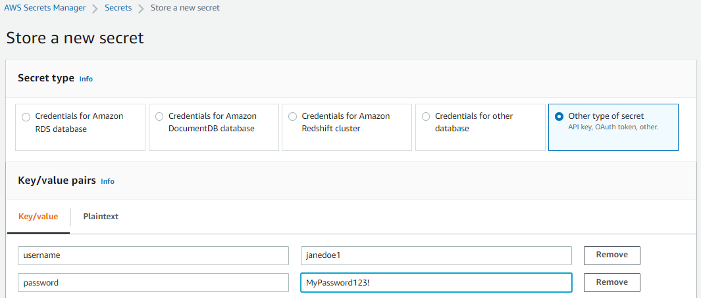

# Use a private container on AWS

## With ECR

If you have a private container image in AWS ECR, you will need to give the
`meadowrun_ec2_role` IAM role access to your container image:

```shell
meadowrun-manage-ec2 grant-permission-to-ecr-repo myreponame
```

See also [general background on granting permissions to the Meadowrun
jobs](../access_resources).

## With other container registries

To use a private container image from a non-AWS ECR container registry like
dockerhub.com, you'll need to give Meadowrun the name of an AWS secret that contains the
username/password for the container registry you want to use.

### Create an AWS Secret

First, [create an AWS
secret](https://docs.aws.amazon.com/secretsmanager/latest/userguide/tutorials_basic.html#tutorial-basic-step1)
called `my_docker_credentials` that contains a key for `username` and a key for
`password`. If you're using the AWS Console, it will look something like:




### Grant permission to the secret

Next, the EC2 instances that are running your code (i.e. the role that they run as) will
need to access this secret:

```shell
meadowrun-manage-ec2 grant-permission-to-secret my_docker_credentials
```

### Use your secret

Now you can use the following [ContainerInterpreter][meadowrun.ContainerInterpreter]
with [Deployment.git_repo][meadowrun.Deployment.git_repo] or
[Deployment.mirror_local][meadowrun.Deployment.mirror_local].

```python
import meadowrun

meadowrun.Deployment.mirror_local(
    interpreter=meadowrun.ContainerInterpreter(
        "my_organization/my_private_container",
        username_password_secret=meadowrun.AwsSecret("my_docker_credentials")
    ),
)
```
