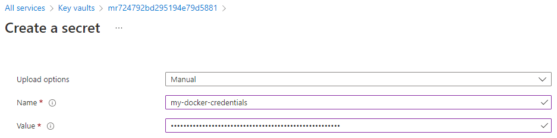

# Use a private container on Azure

## With Azure Container Registry

If you have a private container image in an Azure Container Registry, you will need to
give the `meadowrun-managed-identity` managed identity access to that Container
Registry. One way to do this is to create your Azure Container Registry in the
`Meadowrun-rg` resource group, which the `meadowrun-managed-identity` has access to by
default. If your Container Registry is in a different resource group, you'll need to
assign an appropriate role to `meadowrun-managed-identity` to give it access. See
[Azure's documentation on assigning
roles](https://docs.microsoft.com/en-us/azure/role-based-access-control/role-assignments-portal)
and [Azure's overview of Container Registry
permissions](https://docs.microsoft.com/en-us/azure/container-registry/container-registry-roles?tabs=azure-cli),
and [general background on granting permissions to the Meadowrun
jobs](../access_resources).

## With other container registries

To use a private container image from a non-Azure Container Registry like dockerhub.com,
you'll need to give Meadowrun the name of an Azure secret that contains the
username/password for the container registry you want to use.

### Get the name of your Meadowrun Key Vault

The Meadowrun Key Vault will be created the first time you use Meadowrun, so if you
haven't done so, [run a function with Meadowrun](../../tutorial/run_function). Next, go to
the Azure portal, and go to "Key Vaults". You should see a Key Vault named something
like "mr724792bd295194e79d5881" in the Meadowrun-rg Resource Group. The actual name will
be "mr" followed by the last 22 letters/numbers of your subscription id (Azure Key Vault
names need to be globally unique).

### Create a secret

Next, create a secret in this Key Vault called `my_docker_credentials` where the secret
value is a json string containing a username and password, like `{"username":
"janedoe1", "password": "MyPassword123!"}`




### Using your secret

Now you can use the following [ContainerInterpreter][meadowrun.ContainerInterpreter]
with [Deployment.git_repo][meadowrun.Deployment.git_repo] or
[Deployment.mirror_local][meadowrun.Deployment.mirror_local].

```python
import meadowrun

meadowrun.Deployment.mirror_local(
    interpreter=meadowrun.ContainerInterpreter(
        "my_organization/my_private_container",
        username_password_secret=meadowrun.AzureSecret("my_docker_credentials")
    ),
)
```
